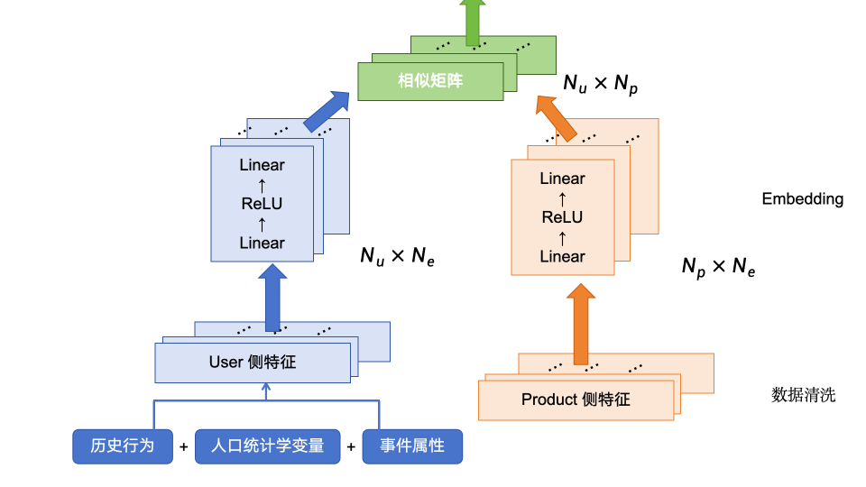
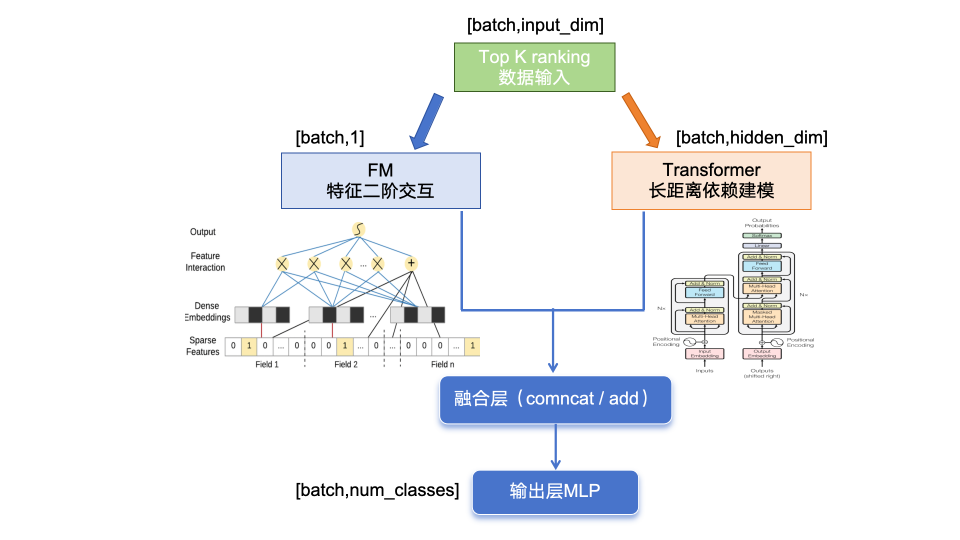

# 第四届中国研究生金融科技创新大赛

## 基于极不平衡样本的客户金融服务产品多步推荐模型

我们是来自武汉大学具有复合背景的团队

队员分别是：肖异芳(武大叉院)、冯慧琳（武大金融）、詹博天（武大网安）、刘元辛（武大管科）、陈实（武大管科）、封博文（武大网安）

### 最终版本：Dual_Tower_and_TransformerFM

#### **模型架构概览：**

**1. Dual_Tower**

**2. Transformer FM**

#### 运行指令

请cd 到"Dual_Tower_and_TransformerFM" 目录下打开终端

**安装必要库：**
pip install -r requirements.txt

**第一步推荐训练：**
python train\_per\_category.py  --data\_dir 'raw\_data' --save\_dir 'outputs'  --epochs 2 --batch\_size 64 --lr 3e-4 --temperature 1.0 --use\_hard\_negative True --margin 0.05 --neg\_weight 0.001

**第一步推荐预测与检验：**
python recommend\_user\_profiles.py --data\_dir 'data'  --model\_dir  'outputs'  --out\_csv 'outputs/recommended\_custs.csv'  --out\_xlsx 'outputs/recommended\_user\_profiles.xlsx'  --k  200

**第二步推荐训练：**
编辑器中运行TransformerFM.ipynb

**第二步推荐预测与检验：**
python second\_step\_recommend.py

#### 文件存储说明

1. 原始数据 **raw\_data**客户表(cust\_dataset), 事件表(event\_dataset), 产品表(productLabels\_multiSpreadsheets)
2. 模型 **models**user\_tower - 用户塔product\_tower - 产品塔dual\_tower - 双塔模型TransformerFM\_model - Transformer模型
3. 训练脚本**utils:**
   data\_cleaner\_v5, feature\_align\_v5 用于清洗数据
   product\_cluster 用于对相同特征的产品进行聚类
   **train\_per\_category:** 用于对每一个产品类别进行训练
   **recommend\_user\_profiles:** 用于预测产品可行的用户list并检验准确性、生成用户画像
4. 训练-预测生成数据
   **cleaned:** 事件、客户数据清洗结果
   **aligned:** 产品表清洗合并结果
   **merged:** 事件、客户、产品合并结果
   **cluster\_products:** 相同特征产品聚类后的结果
   **outputs:**
   双塔(Dual-Tower)模型：
   模型存储(model\_A/C/D/N/P)、训练日志(train\_log)、第一步预测结果与用户画像(recommended\_user\_profiles)、推荐客户信息汇总(recommend\_custs)
   TransformerFM模型：
   模型存储(transformer\_fm\_product\_classifier\_A/C/D/N/P)、训练日志(transformer\_training\_summary)、
   **step2\_recommend:** 第二步预测推荐结果(recommend\_A/C/D/N/P)
